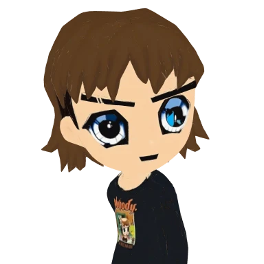
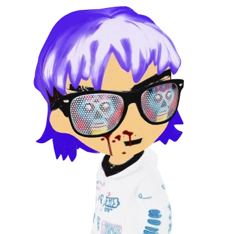
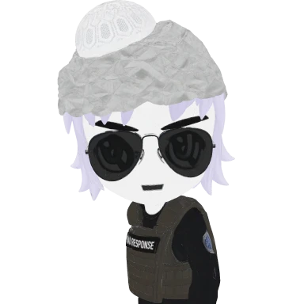

# radbros-3d

four radbros as rigged, animated 3d characters. glTF, textures baked in, free to use for anything.

| [](radbro652) | [](radbro4764) | [](radbro2564) | [](radbro723) |
|:-:|:-:|:-:|:-:|
| [**#652**](radbro652) · nobody sweatshirt | [**#4764**](radbro4764) · katana | [**#2564**](radbro2564) · ghost | [**#723**](radbro723) · cowboy hat |

## download

full-quality files are on the [release page](https://github.com/dexedrne/radbros-3d/releases/tag/v1).

| file | what's in it |
|---|---|
| [radbros-3d-all.zip](https://github.com/dexedrne/radbros-3d/releases/download/v1/radbros-3d-all.zip) | all four, every clip, plus the web versions and a long readme (clip timings, root motion, rig notes). start here. |
| [radbro652-3d-model-v3.zip](https://github.com/dexedrne/radbros-3d/releases/download/v1/radbro652-3d-model-v3.zip) | #652 on its own |
| [radbro4764-3d-model-v3.zip](https://github.com/dexedrne/radbros-3d/releases/download/v1/radbro4764-3d-model-v3.zip) | #4764 on its own |
| [radbro2564-3d-model.zip](https://github.com/dexedrne/radbros-3d/releases/download/v1/radbro2564-3d-model.zip) | #2564 on its own (7 clips; the all-in-one zip has his full 21) |
| [radbro723-3d-model.zip](https://github.com/dexedrne/radbros-3d/releases/download/v1/radbro723-3d-model.zip) | #723 on its own (12 clips; the all-in-one zip has 14) |

each character comes as a static mesh, a rigged mesh in rest pose, and a rigged mesh with all its clips.

this repo holds the small web versions, one folder per character:

- `radbroNNN_web.glb`: mesh, skeleton and 4 clips (walk, run, sprint, jump). draco-compressed, unlit, 1024 webp texture. 0.6-0.9 MB.
- `radbroNNN_clips_web.glb`: skeleton and the rest of the clips, no mesh. load it next to the web file.
- `preview_radbroNNN.png`: turnaround. studio-lit on top, true flat colours below.
- `portrait_radbroNNN.webp`: 384px head and shoulders, transparent background.

## specs

- 1.70 m tall (#723 is 1.80 with the hat). metres, y-up, facing +z, origin on the ground between the feet
- ~60k triangles, one mesh and one 2048 texture each. #4764's katana is its own small mesh on the hips, so you can hide it
- 24-bone mixamo-style rig with the same bone names on all four. no finger bones
- flat art style: the colour map also drives emissive, so they read like the 2d art under any light. an unlit material gives exact colours
- no props. fishing, hanging and sitting are the motion only

## clips

| clip | plays | on |
|---|---|---|
| Idle | loop | all |
| Casual_Walk | loop | all |
| Run_02 | loop | all |
| Lean_Forward_Sprint | loop, moves forward | all |
| Regular_Jump | once | all |
| Big_Wave_Hello | once | all |
| Victory_Cheer | loop | all |
| Rope_Hang_Idle | loop, right hand up | all |
| Grab_Bar_and_Swing_Forward | once, moves forward | all |
| Falling_Down | once | all |
| Fishing_Cast | once | all |
| Waltz | once, turns ~180° | all |
| Free_Fall | loop | all |
| Big_Land | once | all |
| Run_and_Jump (front flip), Leap_of_Faith, Fall_1, Roll_Dodge | once / loop | #2564 |
| Stand_to_Sit_Transition_M, Chair_Sit_Idle_M, Sit_Lie_Bed | once / loop | #2564, full files only |

root motion sits on the Hips bone. if your controller moves the character itself, hold the hips' x/z on the clips that travel.

## use it

### three.js

```js
import * as THREE from 'three'
import { GLTFLoader } from 'three/addons/loaders/GLTFLoader.js'
import { DRACOLoader } from 'three/addons/loaders/DRACOLoader.js'

const base = 'https://cdn.jsdelivr.net/gh/dexedrne/radbros-3d@v1/radbro4764/'
const draco = new DRACOLoader().setDecoderPath('https://cdn.jsdelivr.net/npm/three@0.186.1/examples/jsm/libs/draco/gltf/')
const loader = new GLTFLoader().setDRACOLoader(draco)

const [bro, more] = await Promise.all([
  loader.loadAsync(base + 'radbro4764_web.glb'),
  loader.loadAsync(base + 'radbro4764_clips_web.glb'),
])
scene.add(bro.scene)

const clips = [...bro.animations, ...more.animations]
const mixer = new THREE.AnimationMixer(bro.scene)
mixer.clipAction(THREE.AnimationClip.findByName(clips, 'Idle')).play()

// every frame: mixer.update(clock.getDelta())
```

clips from `_clips_web.glb` bind to the character by bone name, so they play on the web file as-is. keep each character's clips with that character; the rigs differ.

### model-viewer

```html
<script type="module" src="https://cdn.jsdelivr.net/npm/@google/model-viewer@4.3.1/dist/model-viewer.min.js"></script>

<model-viewer
  src="https://cdn.jsdelivr.net/gh/dexedrne/radbros-3d@v1/radbro723/radbro723_web.glb"
  animation-name="Casual_Walk" autoplay camera-controls>
</model-viewer>
```

### blender

File > Import > glTF 2.0. the full-quality files from the release come in with the rig and every clip as an action.

## license

[Viral Public License](LICENSE). use them, remix them, re-rig them, sell them, put them in your game. anything made from them keeps the same license, and no one can add restrictions on top.

radbros #652, #4764, #2564 and #723 are my own radbros, made 3d with the Radbro Webring dev's ok. original characters by [Radbro Webring](https://radbro.xyz). 3d models by dexedrne.

made something with them? tag [@dexedrne](https://x.com/dexedrne).
