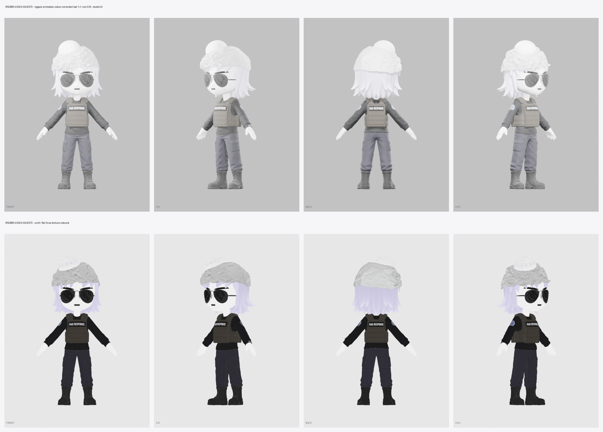

# radbro #2564 · ghost

- tin-foil hat over a white kufi, aviators, ghost-white skin, pale lavender hair, RAD RESPONSE plate carrier. all one mesh.
- the nft is a bust, so the lower body was designed to match: dark tactical cargo trousers and black combat boots.
- the steam deck from the nft was left out. hands open and empty, parent props to RightHand.
- small texture quirks: the RAD RESPONSE patch also shows on the back of the vest, the round patch is on both sleeves, and the foil is softer than the nft's crumple.

## files here

| file | what |
|---|---|
| `radbro2564_web.glb` | mesh, skeleton and 4 clips: Casual_Walk, Run_02, Lean_Forward_Sprint, Regular_Jump. draco-compressed (needs a draco decoder), unlit, 1024 webp texture |
| `radbro2564_clips_web.glb` | skeleton only, no mesh: Idle, Big_Wave_Hello, Victory_Cheer, Rope_Hang_Idle, Grab_Bar_and_Swing_Forward, Run_and_Jump, Leap_of_Faith, Fall_1, Roll_Dodge, Falling_Down, Fishing_Cast, Waltz, Free_Fall, Big_Land |
| `preview_radbro2564.png` | turnaround. studio-lit on top, true flat colours below |
| `portrait_radbro2564.webp` | 384px head and shoulders, transparent |

load `_clips_web.glb` next to `_web.glb` and play its clips on that character. they bind by bone name.

## full quality

[radbros-3d-all.zip](https://github.com/dexedrne/radbros-3d/releases/download/v1/radbros-3d-all.zip) has #2564 with all 21 clips in one file (the sit and lie clips included), a rigged rest-pose file and a static mesh. [radbro2564-3d-model.zip](https://github.com/dexedrne/radbros-3d/releases/download/v1/radbro2564-3d-model.zip) has him on his own.

- 1.70 m tall, metres, y-up, facing +z, origin between the feet
- 61,304 triangles, 2048 colour map (also wired to emissive for the flat look)
- 24-bone mixamo-style rig, same bone names as the other three
- the static file is 1.90 units tall with a centred origin; the rigged files are the ones to use in a game

## license

[Viral Public License](../LICENSE). original character by [Radbro Webring](https://radbro.xyz), 3d model by dexedrne.
