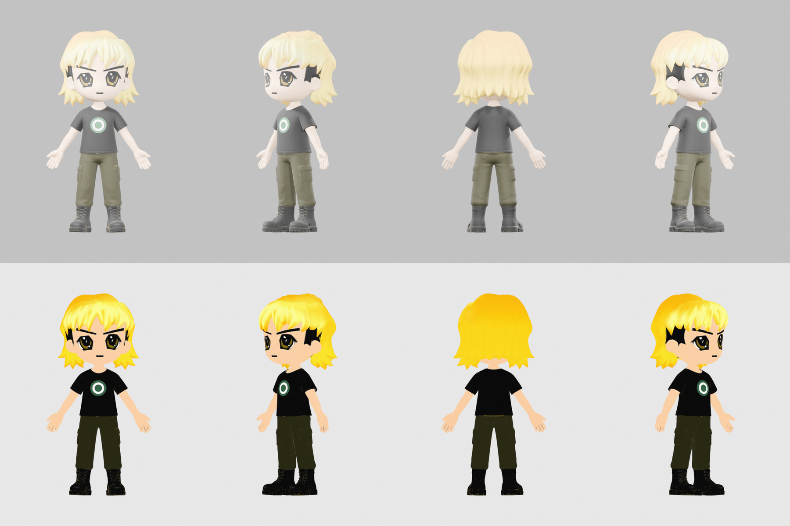

# radbro #3704 · launcher

- golden-yellow mop, big gold anime eyes, thick angled brows, black short-sleeve tee with green-and-white rings.
- the nft is a bust, so the lower body was designed to match: dark olive cargo trousers and black lace-up boots.
- the launcher is a separate prop file in the zip, `prop_3704_launcher.glb` (plus a small web version). it is not attached to the body. hands open and empty; parent props to RightHand.
- same proportions as #652 and #4764. small gold-coloured texture flecks remain on the boots and dark outfit.

## files here

| file | what |
|---|---|
| `radbro3704_web.glb` | mesh, skeleton and 4 clips: Casual_Walk, Run_02, Lean_Forward_Sprint, Regular_Jump. draco-compressed (needs a draco decoder), unlit, 1024 webp texture. 676,668 bytes (0.68 MB) |
| `radbro3704_clips_web.glb` | skeleton only, no mesh; 19 clips: Idle, Big_Wave_Hello, Victory_Cheer, Rope_Hang_Idle, Grab_Bar_and_Swing_Forward, Falling_Down, Fishing_Cast, Waltz, Free_Fall, Big_Land, Wall_Run_Up, Wall_Run, Wall_Run_Mirror, Ledge_Grab, Vault, Slide, Wall_Climb, Ledge_Climb, Land_Roll. 1,129,684 bytes (1.13 MB) |
| `preview_radbro3704.png` | turnaround. studio-lit on top, true flat colours below. 837,813 bytes |
| `portrait_radbro3704.webp` | 384px head and shoulders, transparent. 21,516 bytes |

load `_clips_web.glb` next to `_web.glb` and play its clips on that character. they bind by bone name.

## full quality

[radbros-3d-all.zip](https://github.com/dexedrne/radbros-3d/releases/download/v1/radbros-3d-all.zip) has #3704 with all 23 clips in one file, a rigged rest-pose file, a static mesh and the separate launcher prop. [radbro3704-3d-model.zip](https://github.com/dexedrne/radbros-3d/releases/download/v1/radbro3704-3d-model.zip) has him on his own (37.40 MB).

- 1.70 m tall, metres, y-up, facing +z, origin between the feet
- 61,355 triangles for the body, 2048 colour map (also wired to emissive for the flat look)
- 24-bone mixamo-style rig, same bone names as the other five. no finger bones
- the static file is also 1.70 m tall and grounded; the rigged files are the ones to use in a game
- the separate launcher has 58,191 triangles and is 0.90 m long, with its origin at the grip, barrels facing +z

## license

[Viral Public License](../LICENSE). original character by [Radbro Webring](https://radbro.xyz), 3d model by dexedrne.
