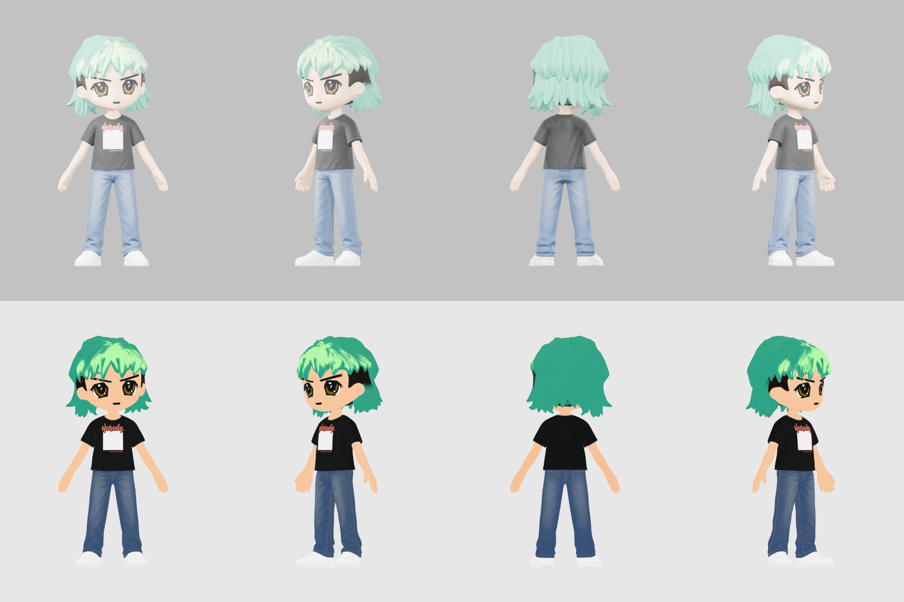

# radbro #3710 · nobody tee

- mint/seafoam mop with pale-green highlights, big gold anime eyes, thick angled brows, black "Nobody." tee with a white rectangle and tiny text.
- the nft is a bust, so the lower body was designed to match: mid-blue jeans and white sneakers.
- the nft's finger-puppet hand was left out. hands open and empty. parent props to RightHand.
- same proportions as #652 and #4764. the tiny shirt text is soft at web resolution.

## files here

| file | what |
|---|---|
| `radbro3710_web.glb` | mesh, skeleton and 4 clips: Casual_Walk, Run_02, Lean_Forward_Sprint, Regular_Jump. draco-compressed (needs a draco decoder), unlit, 1024 webp texture. 667,320 bytes (0.67 MB) |
| `radbro3710_clips_web.glb` | skeleton only, no mesh; 19 clips: Idle, Big_Wave_Hello, Victory_Cheer, Rope_Hang_Idle, Grab_Bar_and_Swing_Forward, Falling_Down, Fishing_Cast, Waltz, Free_Fall, Big_Land, Wall_Run_Up, Wall_Run, Wall_Run_Mirror, Ledge_Grab, Vault, Slide, Wall_Climb, Ledge_Climb, Land_Roll. 1,129,812 bytes (1.13 MB) |
| `preview_radbro3710.png` | turnaround. studio-lit on top, true flat colours below. 843,176 bytes |
| `portrait_radbro3710.webp` | 384px head and shoulders, transparent. 22,642 bytes |

load `_clips_web.glb` next to `_web.glb` and play its clips on that character. they bind by bone name.

## full quality

[radbros-3d-all.zip](https://github.com/dexedrne/radbros-3d/releases/download/v1/radbros-3d-all.zip) has #3710 with all 23 clips in one file, a rigged rest-pose file and a static mesh. [radbro3710-3d-model.zip](https://github.com/dexedrne/radbros-3d/releases/download/v1/radbro3710-3d-model.zip) has him on his own (20.63 MB).

- 1.70 m tall, metres, y-up, facing +z, origin between the feet
- 61,327 triangles, 2048 colour map (also wired to emissive for the flat look)
- 24-bone mixamo-style rig, same bone names as the other five. no finger bones
- the static file is also 1.70 m tall and grounded; the rigged files are the ones to use in a game

## license

[Viral Public License](../LICENSE). original character by [Radbro Webring](https://radbro.xyz), 3d model by dexedrne.
