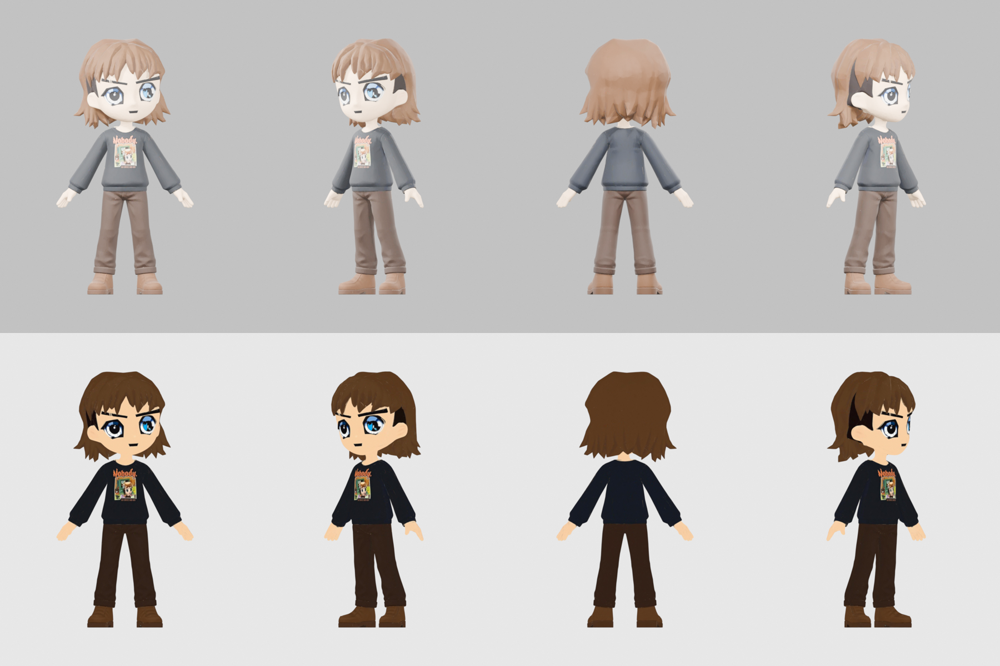

# radbro #652 · nobody sweatshirt

- brown mop, big blue anime eyes (the right one bigger, like the nft), thick angled brows, black "Nobody" sweatshirt.
- the nft is a bust, so the lower body was designed to match: dark brown trousers and brown boots.
- hands open and empty. parent props to RightHand.
- v3 remake: same proportions as #2564 and #723. files from earlier versions (the chibi one) do not match this mesh or skeleton, so don't mix clips between them.

## files here

| file | what |
|---|---|
| `radbro652_web.glb` | mesh, skeleton and 4 clips: Casual_Walk, Run_02, Lean_Forward_Sprint, Regular_Jump. draco-compressed (needs a draco decoder), unlit, 1024 webp texture |
| `radbro652_clips_web.glb` | skeleton only, no mesh: Idle, Big_Wave_Hello, Victory_Cheer, Rope_Hang_Idle, Grab_Bar_and_Swing_Forward, Falling_Down, Fishing_Cast, Waltz, Free_Fall, Big_Land |
| `preview_radbro652.png` | turnaround. studio-lit on top, true flat colours below |
| `portrait_radbro652.webp` | 384px head and shoulders, transparent |

load `_clips_web.glb` next to `_web.glb` and play its clips on that character. they bind by bone name.

## full quality

[radbros-3d-all.zip](https://github.com/dexedrne/radbros-3d/releases/download/v1/radbros-3d-all.zip) has #652 with all 14 clips in one file, a rigged rest-pose file and a static mesh. [radbro652-3d-model-v3.zip](https://github.com/dexedrne/radbros-3d/releases/download/v1/radbro652-3d-model-v3.zip) has him on his own.

- 1.70 m tall, metres, y-up, facing +z, origin between the feet
- 59,079 triangles, 2048 colour map (also wired to emissive for the flat look)
- 24-bone mixamo-style rig, same bone names as the other three
- the static file is 1.90 units tall with a centred origin; the rigged files are the ones to use in a game

## license

[Viral Public License](../LICENSE). original character by [Radbro Webring](https://radbro.xyz), 3d model by dexedrne.
