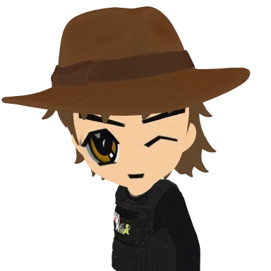
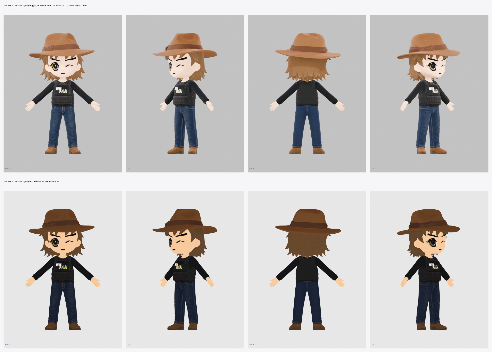

# radbro #723 · cowboy hat

- wide-brim brown felt hat, shaggy brown hair, the wink, black shirt under a black plate carrier with the HOT TOPIC / BRO patch and a small TempleOS patch.
- the nft is a bust, so the lower body was designed to match: dark indigo jeans and brown leather cowboy boots.
- the hat is part of the mesh and follows the Head bone, so it can't be removed. it counts toward his height.
- hands open and empty. parent props to RightHand.

## files here

| file | what |
|---|---|
| `radbro723_web.glb` | mesh, skeleton and 4 clips: Casual_Walk, Run_02, Lean_Forward_Sprint, Regular_Jump. draco-compressed (needs a draco decoder), unlit, 1024 webp texture |
| `radbro723_clips_web.glb` | skeleton only, no mesh: Idle, Big_Wave_Hello, Victory_Cheer, Rope_Hang_Idle, Grab_Bar_and_Swing_Forward, Falling_Down, Fishing_Cast, Waltz, Free_Fall, Big_Land |
| `preview_radbro723.png` | turnaround. studio-lit on top, true flat colours below |
| `portrait_radbro723.webp` | 384px head and shoulders, transparent |

load `_clips_web.glb` next to `_web.glb` and play its clips on that character. they bind by bone name.

## full quality

[radbros-3d-all.zip](https://github.com/dexedrne/radbros-3d/releases/download/v1/radbros-3d-all.zip) has #723 with all 14 clips in one file, a rigged rest-pose file and a static mesh. [radbro723-3d-model.zip](https://github.com/dexedrne/radbros-3d/releases/download/v1/radbro723-3d-model.zip) has him on his own.

- 1.80 m including the hat tall, metres, y-up, facing +z, origin between the feet
- 59,633 triangles, 2048 colour map (also wired to emissive for the flat look)
- 24-bone mixamo-style rig, same bone names as the other three
- the static file is 1.90 units tall with a centred origin; the rigged files are the ones to use in a game

## license

[Viral Public License](../LICENSE). original character by [Radbro Webring](https://radbro.xyz), 3d model by dexedrne.
